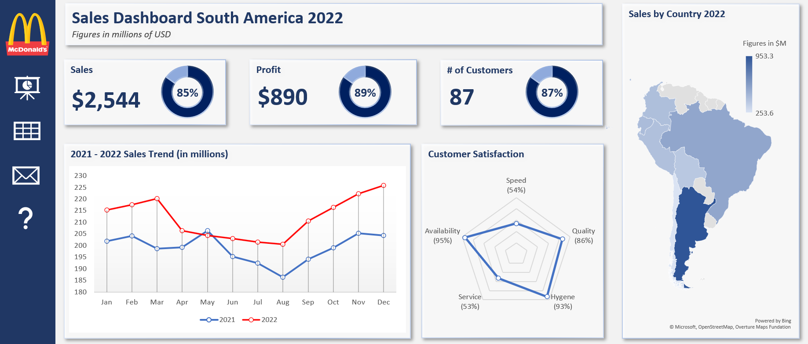

# Sales-Dashboard-of-MacDonald-in-South-America in 2022


## 1) Project Overview

The tutorial demonstrates how to build an **interactive Excel sales dashboard** (for a South America fast-food business scenario).

The workbook contains three worksheets:

* **Dashboard** → final report view
* **Inputs** → raw data used to build visuals
* **Contacts** → manager contact list

The process follows 3 stages:

1. Make the dashboard dynamic (navigation & structure)
2. Create charts & visuals
3. Customize and assemble the final dashboard

> Example outputs of the completed tracker.

### Coffee Sales Dashboard (using Excel)



---

## 2) Making the Dashboard Dynamic

### Hyperlink Navigation

Icons on the dashboard act like buttons and link to other sheets.

Steps:
Right click shape → **Link → Place in this document**

Examples:

* Dashboard icon → Dashboard sheet
* Data icon → Inputs sheet
* Contacts icon → Contacts sheet
* Support icon → Email address (e.g. `info@support.com`)

After creating links, copy the navigation column to all worksheets so users can move between pages.

---

## 3) Designing the Dashboard Layout

Shapes are used as containers.

Insert → Shapes → **Rounded Rectangle**

Create layout:

* Title banner
* 3 KPI cards (Sales, Profit, Customers)
* Large trend chart
* Customer satisfaction chart
* Map chart (sales by country)

Formatting:

* Fill: White
* Outline: None
* Add shadow for modern UI look

---

## 4) Creating Charts and Visuals

All charts are built from the **Inputs sheet**.

---

### A) Customer Satisfaction — Radar Chart

Select satisfaction data → Insert → Radar Chart

Actions:

* Remove legend
* Remove chart title
* Resize and place later

Purpose:
Compare categories (speed, service, quality, etc.)

---

### B) Sales by Country — Map Chart

Select country sales data → Insert → Maps → Filled Map

Remove chart title.

Purpose:
Geographic performance visualization

---

### C) Sales Trend — Line Chart

Select time-series sales data → Insert → Recommended Charts → Line Chart

Adjust axis scale:
Right click axis → Format Axis → Minimum = `180`

Purpose:
Zoom into meaningful range for easier comparison.

---

### D) KPI Progress — Donut Charts

KPIs show completion toward targets.

Formula used:

```excel
Completion % = Actual / Target
```

For example:

```excel
=B2/C2
```

Create donut chart using:

* Completed value
* Remaining value

Remaining:

```excel
=1 - (Actual/Target)
```

---

### Dynamic Percentage Label (inside donut)

Insert → Text Box

Instead of typing value manually:
Click text box → Formula bar → link cell

```excel
=E5
```

Now percentage updates automatically.

Adjust donut thickness:
Format Data Series → Donut Hole Size = 65%

Repeat for all KPIs.

---

## 5) Customizing Visual Appearance

Charts are moved from Inputs → Dashboard.

---

### Map Chart Formatting

* Remove legend
* Remove border
* Remove background fill

Result: larger visible map area

---

### Line Chart Styling

* Change color lines (red & dark blue)
* Add circle markers
* White marker fill
* Colored borders

Improves readability.

---

### Radar Chart Styling

* Dark blue line
* Circle markers
* White fill + colored border
* Remove background and border

---

### KPI Numeric Labels

Add dynamic values beside donut charts:

Insert → Text Box → Link to cell

Example:

```excel
=Inputs!B2
```

Use Format Painter to copy styling.

---

### Donut Colors

Completed portion → Dark Blue
Remaining portion → Light Blue

Remove chart background and outline.

---

## 6) Final Dashboard Features

The finished dashboard provides:

* Interactive navigation buttons
* KPI completion tracking
* Sales trend analysis
* Customer satisfaction breakdown
* Geographic sales performance

All values update automatically when data changes because:

* Charts are linked to Inputs sheet
* Text boxes reference cells
* Percentages use formulas

---

## Key Excel Techniques Learned

### Dynamic Linking

Link shapes & text boxes to cells

### Dashboard Formulas

```excel
Completion % = Actual / Target
Remaining = 1 - Completion
```

### Chart Optimization

* Axis scaling
* Marker customization
* Removing clutter (legends, borders)

### UI Design Tricks

* Shapes as containers
* Shadow effects
* Consistent color theme
* Format Painter for uniform styling

---

